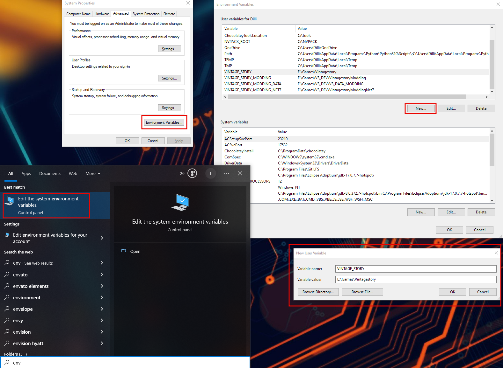
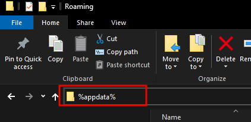
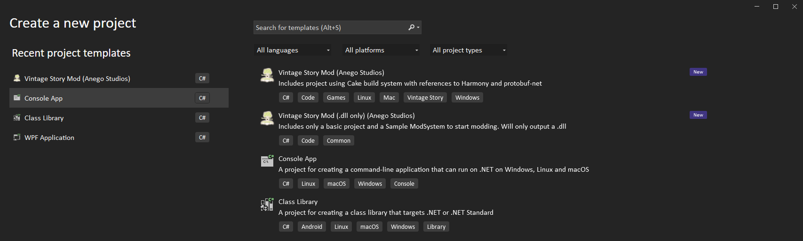
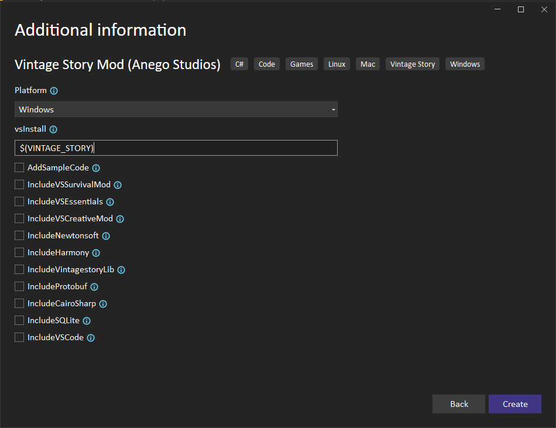
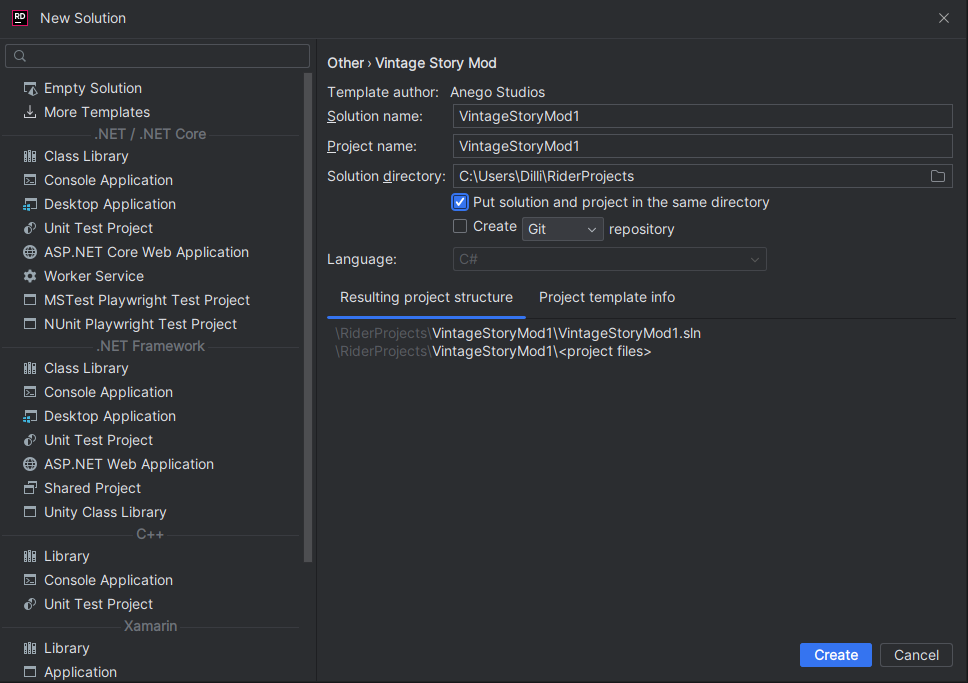

# Vintage Story Modding

## Mod Examples
This repository contains multiple sample mods which are configured as a .NET 7 project (`code_mods`) that let's you start Vintage Story and test your mod directly from within Visual Studio, Visual Studio Code and Rider. For instructions how to setup a dev environment follow the instructions below.

The folder `json_mods` contains mods purely made in json. Simply drop the folder of the mod you wanna test into your `Mods` folder and start the game.

## Requirements

- [.Net 7.0 SDK](https://dotnet.microsoft.com/en-us/download/dotnet/7.0)
- IDE or Code Editor of choice
    Here are some recommendations

    - [Visual Studio Community](https://visualstudio.microsoft.com/free-developer-offers/) (free) for Windows
    - [Visual Studio for Mac](https://visualstudio.microsoft.com/free-developer-offers/) (free) for Mac
    - [Visual Studio Code](https://visualstudio.microsoft.com/free-developer-offers/) (free) for Windows / Mac / Linux
    - [JetBrains Rider](https://www.jetbrains.com/rider/) (Paid - 30 day trial) for Windows / Mac / Linux


## Setup the environment

### 1. Set the `VINTAGE_STORY` Environment Variable
The `VINTAGE_STORY` Environment Variable simplifies reusing your Vintage Story game installation path and helps if multiple modders work on the same project to reference the `VINTAGE_STORY` Environment Variable and have their game installed where ever they want. 

#### Windows:
 Search in Windows search for `Edit the system environment variables` > `Environment Variables...` > User variables for USER > New > Add insert the Variable name: `VINTAGE_STORY` and add the the path to your Vintage Story installation.
 
 
 For example the default installation directory would be `C:\Users\<Userername>\AppData\Roaming\Vintagestory`, (replace <Username> with your username) if you are not sure where yours is type `%appdata%` into the URL field in the File Explorer and hit ENTER. It will take you to your AppData folder where Vintage Story should be installed if you haven't changed the default installation location.
 

 Note: 
 
 Do not confuse the `VintagestoryData` directory in the `%appdata%` folder. The `VintagestoryData` directory only holds your Settings, Logs, Savegames and Mods.


#### Linux and Mac:

To set a environment variable in Linux/Mac you need to add

```shell
export VINTAGE_STORY="$HOME/VintageStoryData/vintagestory"
```
replace the path with the one where your Vintagestory installation is located. The above path should point to your install when you installed Vintagestory using the install.sh script.

Run `echo $SHELL` in a terminal to see what shell your are using.

- for Bash

    place it in: `~/.bashrc` or `~/.bash_profile` at the end
- for Zsh

    place it in: `~/.zshrc` or `~/.zprofile` at the end
- if you use another shell see their documentation how their shell startup file is called


Tips:
 Further you can have multiple game versions installed and test against new release while your main installation stays the same. So you could either change the `VINTAGE_STORY` Environment Variable to point to a different installation of the game, or you can add multiple Environment Variable for different installations.
 So lets say you have version 1.18.5 installed and the new 1.18.6-rc.2 then you could point your `VINTAGE_STORY` to 1.18.5 path and `VINTAGE_STORY_PRE` to 1.18.6-rc.2. then you only have to change the VINTAGE_STORY to VINTAGE_STORY_PRE in your mods .csproj and Properties/launchSettings.json to use the new installation.


### 2. Setup a mod

The first and recommended option would be to use the **template package**. This one allows use update it easily and once you create a new mod you get the new one already.

 1. Install the mod **template package**

    [Mod template package](https://github.com/Th3Dilli/dotnet_mod_templates)

    ```shell
    dotnet new install VintageStory.Mod.Templates
    ```

    This will download the latest mod template package from [nuget.org VS template](https://www.nuget.org/packages/VintageStory.Mod.Templates)

    Once the template is installed you will see it inside Visual Studio and Rider. From there you can use the templates to create a new Project.


    **Visual Studio:**

    We advise to check the option  `Place solution and project in the same directory` for Visual Studio
   
    This will flatten the project tree by one folder and make it easier to navigate.
    
    
    
    

    **Rider:**

    We advise to check the option `Put solution and project in the same directory` for Rider
   
    This will flatten the project tree by one folder and make it easier to navigate.
    

    Note: Unfortunately as of writing this Rider does not support those options in the UI yet but you can check this [issue](https://youtrack.jetbrains.com/issue/RIDER-16759/Support-parameters-in-custom-project-templates) for updates (they recently started working on it)

    If you are using VS Code or Rider or want to use the CLI you can use all template options on the CLI.
    
    ```shell
    # To create a new VS mod
    dotnet new vsmod
    # or create a dll/code only mod
    dotnet new vsmodd

    # Run to get help for how to use th CLI options
    dotnet new vsmod --help
    ```

    When using the CLI you can specify these [options](Template_Options.md) like so:

    ```shell
    # Will create a new Mod Project with the dependency for VSSurvivalMod
    dotnet new vsmod --IncludeVSSurvivalMod
    ```

    **VSCode**

    ```shell
    # Will create a new Mod Project with launch.json and task.json to easily start it
    dotnet new vsmod --IncludeVSCode
    ```

    **Linux and Mac**


    ```shell
    # Will create a new Mod Project and update Vintagestory.exe to Vintagestory for the launchers
    dotnet new vsmod --Platform Linux
    ```

    ---


    **Updating the templates**

    To update all installed templates you can run:
    ```shell
    dotnet new update
    ```

    But this should not be necessary since when creating a new mod using the template it will check automatically if a new version of the template is available.

2.  Use the **Github template** to create a new mod
    
    [Github Mod template](https://github.com/Th3Dilli/mod_template)

    The Github Mod template provides a easy way to get the basics for mod setup so you can start directly with adding your modifications to the game.

    **Without using git and Github account** (_Beginner friendly_)

    To get a copy of the template click the `<> Code` button on the Github repository site. Then download the template as ZIP file and extract it. 

    **Using Github and or git cli** (_Advanced_)

    You can directly click on `Use this template` on the Github repository site to create a copy of it to your Github account.
    After that you can clone your new repository to your computer.
    
    If you do not use Github just clone the repo and upload to your preferred git hosting provider (Gitlab, BitBucket, ...)
    
    ---

    Once you have a copy of the template locally you need to change the following:

    In `modtemplate\resources\modinfo.json`
    change the `name`, `modid` , `authors` and `description`.
    
    For a full list of available options see [VS Wiki Modinfo](https://wiki.vintagestory.at/index.php/Modinfo).

    The `modid` has to contain only lowercase letters and numbers. No special chars, whitespaces, uppercase letters, etc. are allowed.

    Next rename the folder `modtemplate\resources\assets\mymodid` to match what your `modid` is.

    Finally change in the file `modtemplate\modtemplateModSystem.cs` 
    ```cs
    Lang.Get("mymodid:hello")
    ```
    `mymodid` to your new modid.

    The file `modtemplate\modtemplateModSystem.cs` can be called whatever you like.

    (Optional ) Further you can change the name `modtemplate` to whatever you like as long as you change all of the following:
    - Folder `modtemplate`
    - File `modtemplate\modtemplate.csproj`
    - In File `CakeBuild\Program.cs`
        ```cs
        ProjectName = "modtemplate";
        ```

    **If you are on linux and used the Github Template** make sure to update in `ModTemplate\Properties\launchSettings.json` the `executablePath`. There you need to remove the `.exe`

    ---

    For each new mod you want to make you will need a new copy of the template.


### Notes

When you set breakpoints they will only be hit once you join a world.
This is because mods only get loaded when joining a world.